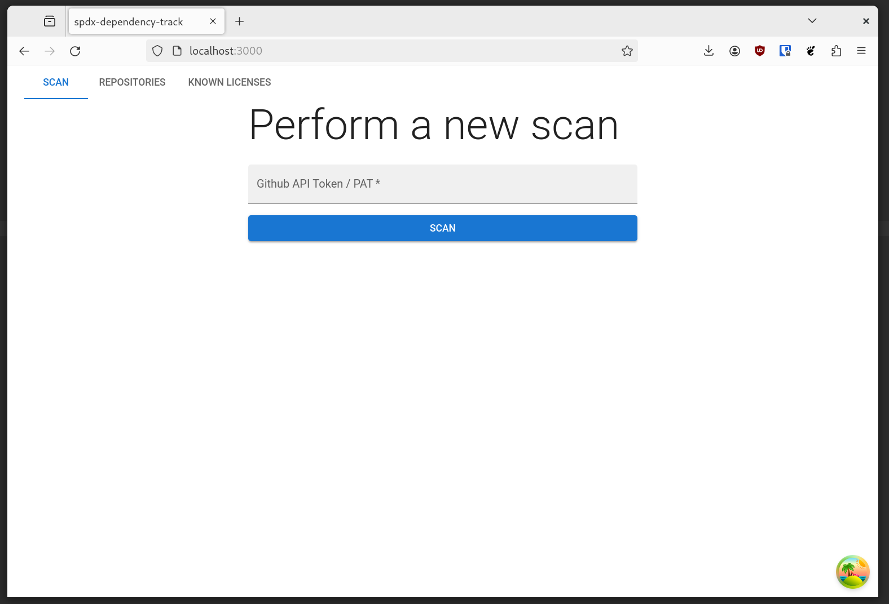
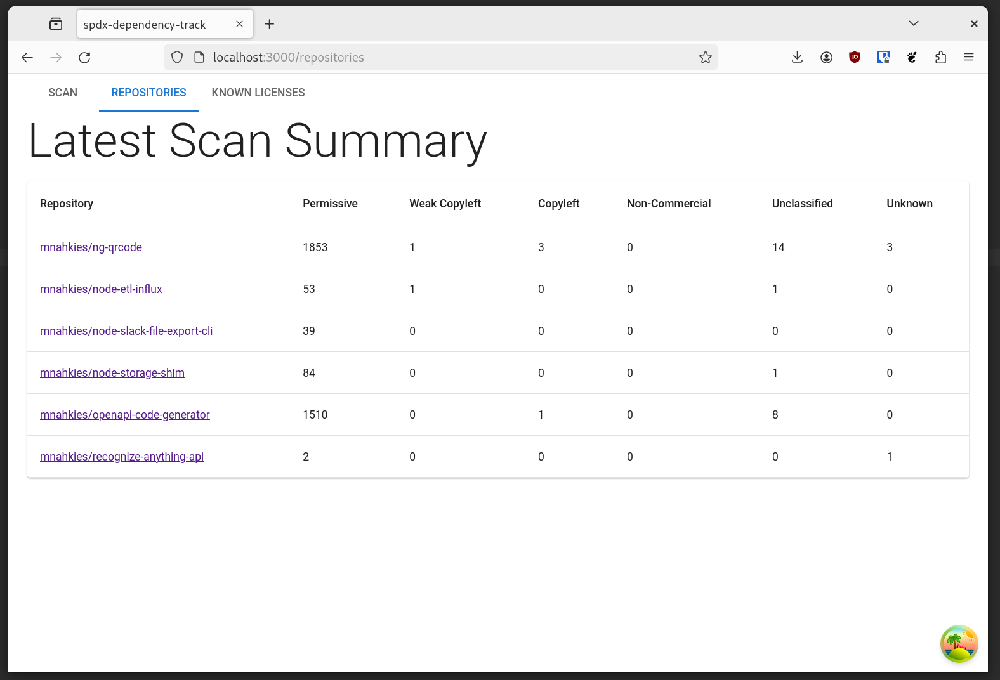
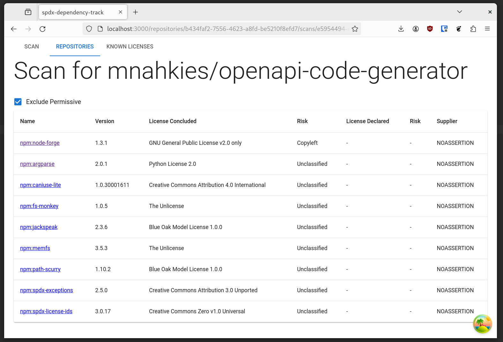

# spdx-dependency-track (pre-alpha)

A simple application to crawl your Github repositories, export SBOMs in SPDX format,
and ingest these for licensing analysis.

Note: I take no responsibility for the legal correctness of the output of this tool. I would
also caution that the SPDX files produced by Github seem a bit rough around the edges at times.

This project is very early stage - it's pretty rough around the edges, has no tests, and is
limited in features. Expect a bunch of breaking changes as I learn more about the world of processing SBOMs.

<!-- toc -->

- [Features](#features)
- [Future](#future)
- [Running it](#running-it)
- [Screenshots](#screenshots)
- [Architecture / Notes](#architecture--notes)
- [Acknowledgements / References](#acknowledgements--references)

<!-- tocstop -->

## Features

- Crawl Github repositories extracting SBOM's using a PAT (Github Personal Access Token)
- Fills in gaps for `npm` packages by reading metadata from the NPM Registry directly
- Render back summary and detail views, including risk categories

## Future

- More filtering, sorting, etc options
- Export to CSV / spreadsheet report
- Allow upload of a SPDX file directly rather than crawling Github
- Allow overriding data, eg: correct a license
- Pull in CVE alerts
- Tidy up the API, it's a bit haphazard right now
- Add tests

## Running it

First, run the development server:

```bash
corepack enable
yarn
cp .env.example .env # modify settings as needed
yarn dev
```

Open [http://localhost:3000](http://localhost:3000) to use the application.
Data will be written to the sqlite db specified by `DB_PATH`.

## Screenshots





## Architecture / Notes

- Implemented as a single [NextJS](https://nextjs.org/) application.
- [mui](https://mui.com/) is used as the component library
- [sqlite](https://sqlite.org/) is used as the database for data persistence
- Database migrations are generated/managed by [atlas](https://atlasgo.io/), see [migrate.sh](./bin/migrate.sh) / [migrate-generate.sh](./bin/migrate-generate.sh)
- Database schema is introspected to produce [zod](https://zod.dev/) schemas for each table, using a script I haven't published anywhere yet
- An basic [openapi.yaml](./openapi.yaml) specification is used to generate most of the client/server glue using [experimental nextjs template](https://github.com/mnahkies/openapi-code-generator/pull/152)
- [mnahkies/openapi-code-generator](https://github.com/mnahkies/openapi-code-generator) is also used to generate the Github client
- License data was scraped from [dependency-track](https://github.com/DependencyTrack/dependency-track)

## Acknowledgements / References

- [dependency-track](https://github.com/DependencyTrack/dependency-track)
- [spdx-spec](https://spdx.github.io/spdx-spec/v2.3/)
- [github docs](https://docs.github.com/en/code-security/supply-chain-security/understanding-your-software-supply-chain/exporting-a-software-bill-of-materials-for-your-repository)
